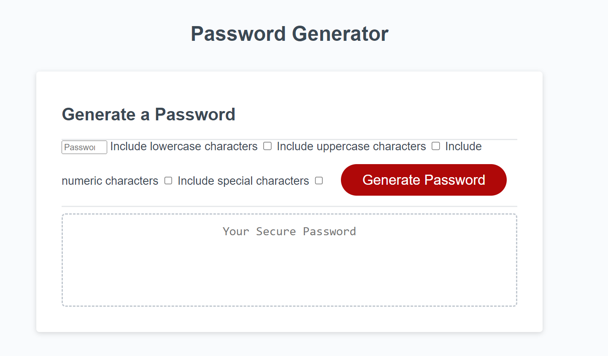

# Password Generator

A simple web application that allows you to generate secure passwords based on your criteria. This project is built using HTML, CSS, and JavaScript.

## Description

In today's digital age, having strong and secure passwords is crucial for protecting your online accounts. This Password Generator is a handy tool that helps you create strong, unique passwords that meet your specific requirements.

## Features

- Generate random passwords with customizable criteria.
- Choose the length of your password (between 8 and 128 characters).
- Select character types to include: lowercase, uppercase, numeric, and special characters.
- Passwords are generated on-the-fly based on your choices.

## Usage

1. Open the Password Generator website in your browser.
2. Choose the desired password length by entering a number between 8 and 128 in the "Password Length" field.
3. Select the character types you want to include in your password by checking the corresponding checkboxes:
   - Include lowercase characters
   - Include uppercase characters
   - Include numeric characters
   - Include special characters
4. Click the "Generate Password" button.
5. Your secure password will be displayed in the text area and will also appear in an alert.

## Deployed Application

Access the deployed Password Generator application by clicking [here](#). 

## License

This project is licensed under the MIT License - see the [LICENSE](LICENSE) file for details.

---

Feel free to use and modify this project for your personal or professional use. If you have any questions or suggestions, please don't hesitate to contact me.
